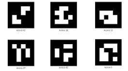

# ArUco Tag Detection and Precision Landing with OpenCV and ROS

This project involves detecting an ArUco tag using OpenCV and utilizing ROS (Robot Operating System) to land on the detected tag. The process is broken down into three main steps:

1. **Detect the ArUco tag in the video feed.**
2. **Estimate the pose of the ArUco tag to understand its position and orientation.**
3. **Use the pose information to guide a robot (or drone) to land on the tag.**

## Step 1: Detect ArUco Tag

Using OpenCV, we will:
- Capture the video feed from a camera.
- Detect ArUco tags in the video frames.
- Draw the detected tags for visualization.

## Step 2: Estimate Pose of ArUco Tag

We will use the detected tag to:
- Estimate its pose (position and orientation) relative to the camera.
- Display the pose information for verification.

## Step 3: Land on the ArUco Tag

Using ROS, we will:
- Publish the pose information of the detected tag to a ROS topic.
- Subscribe to this topic with a landing controller node.
- Guide the drone to land on the tag using the pose information.

### Detected ArUco Tag

 ArUco Tag

## Requirements

To get started, ensure you have the following installed:

- Python 3.x
- OpenCV
- ROS (Robot Operating System)

## Resources

- For ArUco tags and OpenCV - https://docs.opencv.org/4.x/d5/dae/tutorial_aruco_detection.html     
- https://pyimagesearch.com/2020/12/21/detecting-aruco-markers-with-opencv-and-python/
